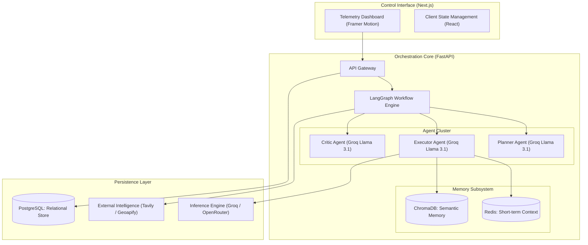

# AgentForge: Autonomous Multi-Agent Orchestration Platform

AgentForge is a sophisticated autonomous system designed to execute complex, multi-stage cognitive and business intelligence tasks. It employs a "Neural-Relational" architecture that integrates high-speed Large Language Models (LLMs), reactive state management, and a tiered memory system to achieve goal-directed autonomy.

## Technical Architecture Overview

The platform is structured into three primary architectural domains: the Control Interface (Frontend), the Orchestration Core (Backend), and the Persistence Layer (Data Management).



## Agentic Orchestration Layer

AgentForge utilizes a specialized agent cluster, orchestrated via LangGraph, to ensure precision and quality throughout the task lifecycle.

### 1. Planner Agent
The Planner is responsible for goal decomposition. Upon receiving a high-level objective, it constructs an optimized sequence of atomic tasks. This prevents logical drift and ensures a structured path toward the user's goal.
- **Inference Model**: Llama 3.1 8B (Groq)

### 2. Executor Agent
The Executor performs the individual tasks defined by the Planner. It leverages internal tools and external APIs to generate content, analyze data, or synthesize information. It interprets semantic context retrieved from long-term memory to maintain consistency with historical performance.
- **Inference Model**: Llama 3.1 70B / 8B (Groq)

### 3. Critic Agent
The Critic operates as an autonomous quality assurance layer. It evaluates the Executor's output against the original goal and the Planner’s specific instructions. If the output fails to meet a predefined quality threshold (numerical score < 8), the Critic triggers an iterative self-correction loop, providing detailed feedback to the Executor.

## Dual-Core Memory Infrastructure

To solve the limitations of stateless LLM interactions, AgentForge implements a tiered memory model inspired by biological cognitive systems.

### Short-term Reactive Memory (Redis)
- **Role**: Maintains task-specific state, execution telemetry, and intermediate variables.
- **Latency**: Sub-millisecond retrieval for real-time adjustments.
- **Retention**: Ephemeral; bound to the lifecycle of the active task.

### Long-term Semantic Memory (ChromaDB)
- **Role**: Stores vector-indexed historical results and successful execution patterns.
- **Mechanism**: Successful agent outputs are embedded and stored in the `db_vector` cluster.
- **Utility**: Enables the Executor Agent to leverage "past experiences" for similar future requests.

## Data Persistence & Schema

All relational data is managed via SQLAlchemy (Async) and stored in a PostgreSQL schema (compatible with Supabase). This ensures transaction integrity and a clear audit trail for every autonomous action.

- **Users Table**: Identity management and authentication metadata.
- **Tasks Table**: Tracking for high-level goals and execution status.
- **Steps Table**: Breakdown of individual actions generated by the Planner.
- **Outputs Table**: Version-controlled results from the Executor-Critic loop.
- **Log Table**: Detailed tool-use telemetry and system traces.
- **Cost Table**: Precision tracking of token consumption and associated LLM costs.

## Technical Stack

- **Frontend**: Next.js 14 (App Router), TailwindCSS, Framer Motion, Lucide.
- **Backend**: FastAPI, LangGraph, SQLAlchemy (AsyncPG), Pydantic.
- **Intelligence**: Groq (Llama 3.1), Tavily Search, Geoapify Geocoding.
- **Infrastructure**: Redis, ChromaDB, PostgreSQL.

## API Specification

### Business Intelligence Workflow
`POST /api/business/analyze`
Starts an automated multi-agent analysis for a specific business query and location.
- **Request Body**:
  ```json
  {
    "user_id": "string",
    "query": "string",
    "location": "string"
  }
  ```

### Task Lifecycle Management
`POST /api/task/create`
Initializes a new autonomous task.
- **Request Body**: `{ "user_id": int, "goal": "string" }`

`GET /api/task/detail/{task_id}`
Retrieves the comprehensive lifecycle data for a specific task, including all intermediary steps and critiqued versions.

## System Configuration & Setup

### Requirements
- Python 3.10 or higher
- Node.js 18 or higher
- PostgreSQL instance (Local or Supabase)
- Redis instance

### Installation

#### Backend Configuration
1. Navigate to the `app` directory.
2. Initialize a virtual environment: `python -m venv venv`.
3. Install dependencies: `pip install -r requirements.txt`.
4. Create a `.env` file with the following variables:
   - `GROQ_API_KEY`: Groq Cloud API Key.
   - `DATABASE_URL`: Async PostgreSQL connection string.
   - `REDIS_URL`: Redis connection string.
   - `GEOAPIFY_API_KEY`: Geoapify API Key.
   - `TAVILY_API_KEY`: Tavily Search API Key.

#### Frontend Configuration
1. Navigate to the `frontend` directory.
2. Install development dependencies: `npm install`.
3. Start the development server: `npm run dev`.

## Project Governance

AgentForge is maintained as a high-performance orchestration framework. Contributions should prioritize architectural consistency and technical precision.
