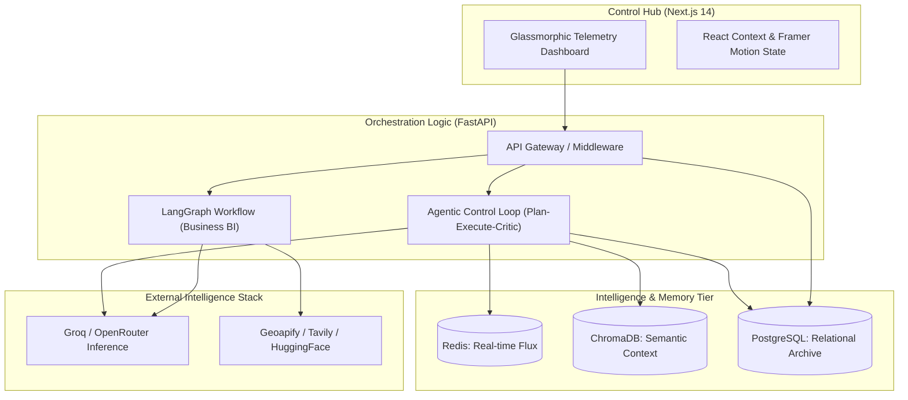

# AgentForge: Technical Manuscript & System Architecture

AgentForge is an autonomous, multi-agent orchestration platform designed to solve complex, high-uncertainty business and cognitive tasks. Unlike traditional LLM-based applications that are often stateless and prone to logical drift, AgentForge implements a **Neural-Relational Paradigm**. This architecture bridges the gap between high-speed stochastic inference (LLMs) and deterministic state management (Relational Databases + Distributed Caching).

---

## 1. Architectural Thesis: The Neural-Relational Paradigm

### Why was AgentForge built this way?
Modern Large Language Models (LLMs) like Llama 3.1 are exceptional at pattern recognition and text generation but lack a "System 2" thinking process—the ability to plan, persist intermediate results, and self-correct. AgentForge was built to provide this missing logical scaffolding.

The project uses a **Tiered Memory Model**:
- **L1 (Short-term/Reactive)**: Redis-based session state for sub-millisecond telemetry synchronization.
- **L2 (Medium-term/Semantic)**: ChromaDB vector storage for retrieving historical success patterns.
- **L3 (Long-term/Relational)**: PostgreSQL for audit-grade logging, transaction integrity, and cost tracking.

---

## 2. System Topology

The platform consists of three distinct yet interconnected layers:

---

## 3. The Agentic Orchestration Layer

AgentForge's "brain" is a cluster of specialized agents governed by an autonomous control loop (`agent_loop.py`).

### 3.1 Planner Agent (`planner.py`)
**Role**: Goal Decomposition Engineer.
**Logic**: When a goal arrives (e.g., "Analyze the coffee market in Noida"), the Planner uses Llama-3.1-8B-Instant via Groq to generate a JSON-enforced sequence of 3-5 atomic steps.
**Why**: Without a plan, LLMs often suffer from "Contextual Drift," where they lose sight of the original goal mid-execution. A fixed plan provides a deterministic logical path.

### 3.2 Executor Agent (`executor.py`)
**Role**: Task Realization Specialist.
**Logic**: The Executor retrieves current step instructions and merges them with "Memory Context" from ChromaDB. It then invokes specialized tools (e.g., `local_search_tool`) to gather real-world data.
**Differentiator**: It uses Llama-3.1-70B for high-fidelity reasoning when tasks require complex synthesis or analysis.

### 3.3 Critic Agent (`critic.py`)
**Role**: Qualitative Gatekeeper.
**Logic**: After execution, the Critic evaluates the output against the original goal. It assigns a **Numerical Score (0-10)** and provides **Iterative Feedback**.
**The Threshold Logic**: If the score is `< 8`, the Critic rejects the output and triggers a re-execution loop. The Executor is then re-invoked with the Critic's feedback injected into its context.

---

## 4. Database Architecture & Relational Integrity

AgentForge uses a highly structured PostgreSQL schema (managed via SQLAlchemy Async) to ensure every action of the agents is auditable, repeatable, and billable.

### 4.1 Schema Breakdown (`models.py`)

| Table | Component | Purpose |
| :--- | :--- | :--- |
| `users` | User Identity | Manages Supabase UIDs, emails, and global identity. |
| `tasks` | Goal Lifecycle | Tracks the high-level objective and overall system state (`pending`, `running`, `completed`). |
| `steps` | Atomic Execution | Stores the internal plan generated by the Planner. Each step has its own status, allowing for Resume-from-Failure logic. |
| `outputs` | Version Cache | Every time the Critic triggers a re-iteration, a new version of the output is saved here. This allows users to see the "evolution" of the agent's thoughts. |
| `logs` | Telemetry Trace | Comprehensive logs of tool usage, including raw inputs and outputs for every API call to Geoapify or Tavily. |
| `costs` | Economic Tracking | Logs exact token counts and estimated USD cost per model per task, enabling enterprise-grade resource management. |

### 4.2 Self-Healing Migrations
The backend includes a "Self-Healing" lifespan event in `main.py` that checks for missing columns (like `supabase_uid`) and automatically runs `ALTER TABLE` commands. This ensures a zero-downtime development experience when syncing with Supabase.

---

## 5. LangGraph: The Business BI Pipeline

For structured data extraction (like Market Analysis), AgentForge uses **LangGraph** (`business_graph.py`). This is a DAG (Directed Acyclic Graph) that ensures tools are executed in a specific, logical order.

### Topology of the Business Graph:
1.  **Local Search (Geoapify)**: Finds real-world businesses based on latitude/longitude biases.
2.  **Competitor Analysis**: Categorizes businesses into "Top" and "Weak" competitors based on normalized ratings.
3.  **Sentiment Analysis (HuggingFace)**: Uses BERT-based transformers to identify "Activation Anchors" (positives) and "Friction Points" (negatives) in customer feedback.
4.  **Trend Analysis (Tavily)**: Scours the live web for industry shifts (e.g., "AI-driven inventory in the cafe sector").
5.  **Strategy Synthesis (OpenRouter)**: Mistral/Mixtral merges all previous node data into a structured 9-point business strategy.

---

## 6. Tiered Memory Architecture

Memory is the differentiator of AgentForge. It solves the "Memory Bottleneck" of standard RAG systems through a multi-layer approach.

### 6.1 L1: Reactive Memory (Redis)
- **What it does**: Stores the "Volatile Task State."
- **How it works**: As the Critic identifies feedback, it is written to Redis. The next agent in the sequence reads from Redis instead of recalculating state.
- **Connection**: Directly connected into the `AgentLoop`.

### 6.2 L2: Semantic Memory (ChromaDB)
- **What it does**: Stores successful outputs as vector embeddings.
- **Why**: If a user asks a similar question tomorrow, the Executor "remembers" successes by querying the `db_vector` collection using cosine similarity.

---

## 7. Frontend Engineering & Telemetry Dashboard

The frontend is a **Next.js 14 (App Router)** application designed for real-time observability of the agent cluster.

- **Glassmorphic Design**: Uses an HSL-based color palette with backdrop-blur filters to create a premium "Command Center" aesthetic.
- **Agent Terminal**: A simulated log feed that allows developers to see the agents' "Inner Thoughts" (Planner -> Executor -> Critic).
- **Physics-Based UI**: Framer Motion handles all layout transitions, including the high-density grid system used for Market Engine results.
- **State Flow**: Uses React Context (`AuthContext`) for cross-application user state and standard `fetch` with polling for task updates.

---

## 8. Configuration & Environment Ecosystem

### Crucial Environment Variables
- `GROQ_API_KEY`: Required for high-speed agent inference (Llama 3.1).
- `GEOAPIFY_API_KEY`: Required for spatial mapping and business geocoding.
- `TAVILY_API_KEY`: Required for advanced web research nodes.
- `OPENROUTER_API_KEY`: Used for strategic synthesis (Mistral models).
- `HUGGINGFACE_API_TOKEN`: Required for BERT-based sentiment transformers.

### Setup Checklist
1. **Database**: Provision a PostgreSQL instance (Supabase recommended).
2. **Memory**: Start a local Redis server (default port 6379).
3. **Inference**: Ensure Groq keys are active for low-latency agent loops.
4. **Tooling**: Obtain API keys for the External Intelligence Stack.

---

## 9. Governance and Scalability

AgentForge is built for modularity. Developers can add new agents by creating a new class in `app/agents/` and a corresponding node in `app/core/business_graph.py`. The system is designed to scale horizontally via FastAPI's asynchronous nature and Redis's distributed state management.
